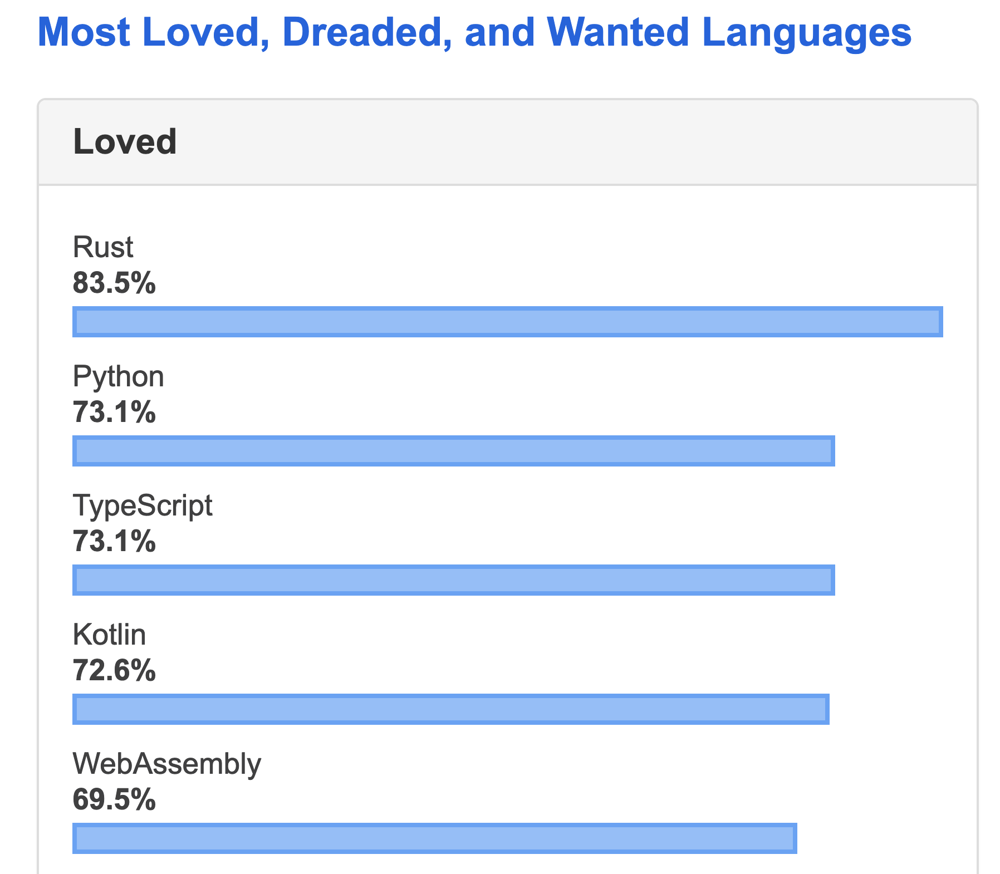

Typescript has been one of the [most loved languages](https://insights.stackoverflow.com/survey/2019#most-loved-dreaded-and-wanted) on stack overflow for several years running.



I didn’t really understand the value of types until I worked on a team.

When multiple people are contributing to a project TS makes it a lot harder to write javascript bugs, and you can trust functions without reading their definitions.

In this video I show 
- the way to start a typescript React app in 10 seconds
- how to set up TS manually for a project
- how to refactor a React app to TS

### If you’re starting from scratch, setting up a TS app is as simple as adding a parameter to create-react-app.

`npx create-react-app my-app --typescript`

i would recommend starting with [create-react-app](https://facebook.github.io/create-react-app/docs/adding-typescript) as a “sandbox” to figure out how things work.

### You can start playing around with things like...

#### Interfaces
I can enforce props with an Interface setting certain fields as optional.

These will be enforced anywhere I use this component, both on compilation and even in your IDE.

```
import React from 'react'

interface IProps {
    name: string,
    showTime: boolean
}

const Hello: React.FC<IProps> = (props) => {
    return (
        <div>
            Hello, {props.name}
            {props.showTime && new Date()}
        </div>
    )
}

export default Hello
```

Alternatively, I can set name as an optional field with the question mark

```
interface IProps {
    name?: string,
    showTime: boolean
}
```

#### Custom types (structs, primitives)
Allow you to enforce object rules through an entire data path.

`gist:aj-4/764604bb562b1c137a0e1721fab182b8`

#### Function typing 
is so useful because you can now “trust” functions to do what they say without trying to figure out what type they expect

```
function formatMessage(person: Person): string {
    return `Welcome, ${person.firstName}... 
        ${person.age}? But you look ${person.age - 10}!`
}
```

### If you want to set up TS manually, or migrate to TS, all that’s really required is 5 steps

The good thing about using React + TS is we are already transpiling our jsx + ES6 to vanilla javascript with webpack

By using the typescript loader, our transpiler will handle `.tsx` files and also act as a “compiler” to catch errors.

If your IDE is set up right (VS code is out of the box) then you will also see errors there.

The end result: we will get the exact same build files with a much improved developer experience.

### The main steps you need to follow are:

1. install dependencies:

`npm i typescript ts-loader`

2. Add a `ts-loader` rule to `webpack.config.js` 
`gist:aj-4/4e5db5e5af5ef8d278e5a640056efc35`
If you are adding `ts` in addition to javascript, simply add to the `rules` section
(you even can delete `babel-loader` and `.babelrc` if you migrate all your jsx!)

3. Next, create a minimal `tsconfig.json` in the project root.
`gist:aj-4/49dfc0b096bba7100cb768d6302d78cb`
full set of rules [here](https://www.typescriptlang.org/docs/handbook/tsconfig-json.html)

4. Write `.tsx` files (or change `.jsx` files to `.tsx`) 
`gist:aj-4/5db7ecba8be67abd10efef45746c34cc`

5. Test with a webpack build, fix compile errors, and repeat

#### done!